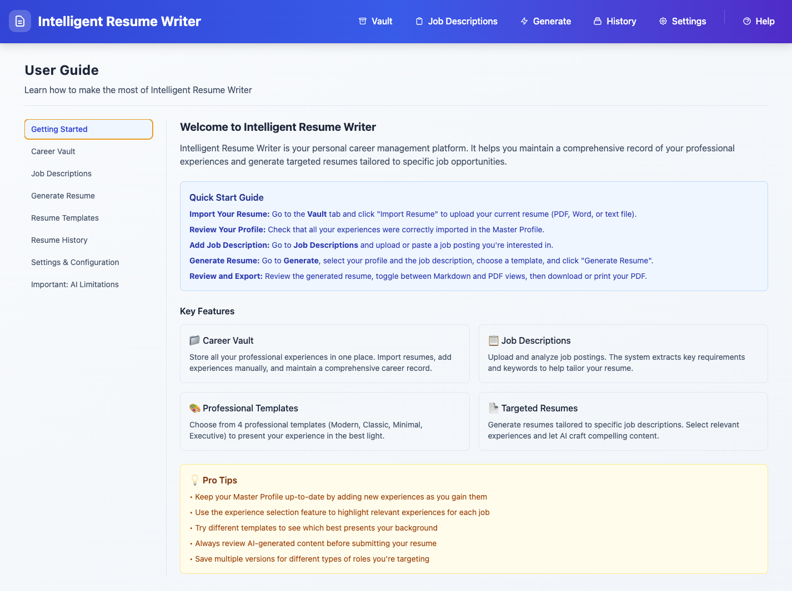

# Intelligent Resume Writer
📦 **Official binary releases for early testers of Intelligent Resume Writer**

## What is Intelligent Resume Writer

**The app creates a curated knowledge base of your professional background from your existing resumes, plain text, or Markdown journals. By providing a job description and selecting relevant experiences, the app generates a targeted resume without hallucination. While it utilizes LLMs, it features a one-click configuration to host models locally via Ollama, ensuring your data remains on your computer.**

## How does the UI look like

## Download

Visit the [Releases page](https://github.com/kevin8xu/resume_writer-releases/releases) for the latest builds for your platform.

## Platforms

- **macOS:** `.zip` (Intel + Apple Silicon)
- **Windows:** `.exe` (installer + portable) - TBD
- **Linux:** `.AppImage` and `.deb` - TBD

## Installation Guides

### macOS

1. Download `.zip` file
2. Open `Intelligent Resume Writer.app`
3. First launch: Right-click → Open (bypass Gatekeeper)
4. Or, in your terminal run the command once: `xattr -cr Intelligent Resume Writer.app` to clear the quarantine bit

### Windows (TBD)

1. Download `Setup.exe`
2. Run installer
3. First launch: Click "More info" → "Run anyway" (SmartScreen)

### Linux (TBD)

**AppImage**
- chmod +x Intelligent-Resume-Writer-*.AppImage
- ./Intelligent-Resume-Writer-*.AppImage

**OR Debian package (TBD)**
    
- sudo dpkg -i intelligent-resume-writer_*.deb

## Source Code

Source code is hosted in a separate private repository at the current stage.

## License

Copyright © 2026 Kevin Xu. All rights reserved.
